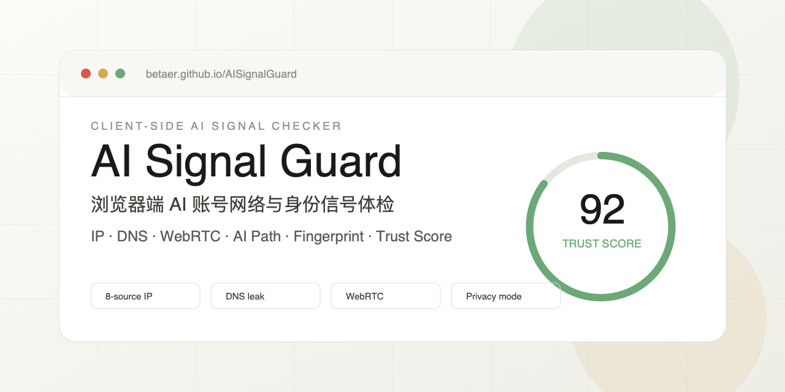
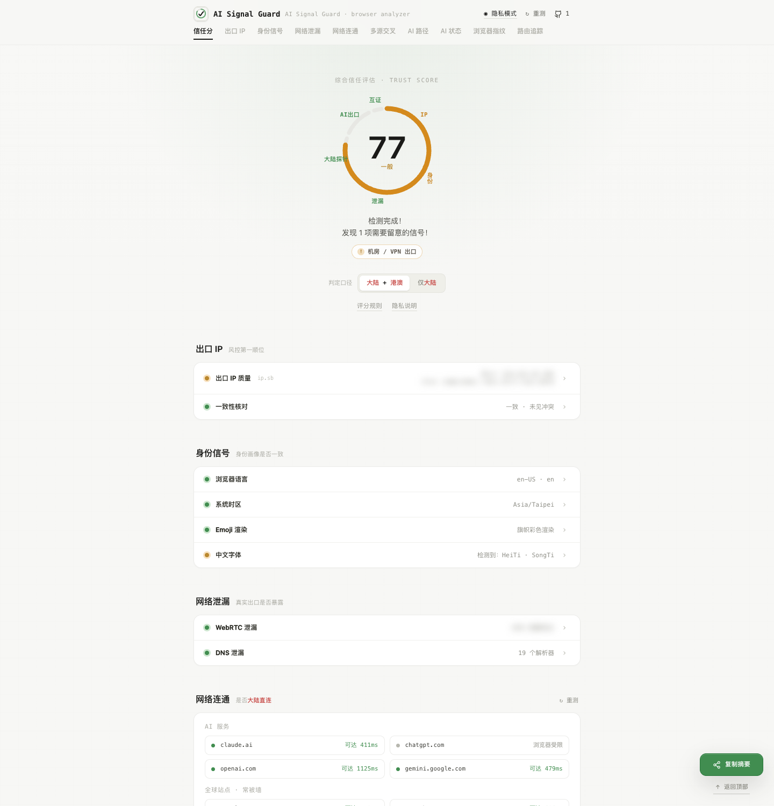

# AI Signal Guard

AI Signal Guard 是一个纯静态的数字身份匹配分析工具。它比较出口 IP、网络类型、DNS、WebRTC、语言、时区、浏览器与服务访问路径等环境信号，回答两个更直接的问题：互联网看到的数字环境是什么样，以及它与目标用户画像有多接近。

项目只分析网络与浏览器环境，不判断访问者的真实国籍、职业或个人身份。所有检测结果仍在当前浏览器中组织和评分。



在线体验：[https://betaer.github.io/AiSignalGuard/](https://betaer.github.io/AiSignalGuard/)

[](https://github.com/betaer/AiSignalGuard) ⭐ Star for AI Signal Guard / 请给本项目点个赞！

[反馈问题](https://github.com/betaer/AiSignalGuard/issues/new/choose)

[查看源码](https://github.com/betaer/AiSignalGuard)


## 出口 IP 截图名片

出口 IP 区域会把当前 IPv4、IPv6、位置、ASN、组织 / ISP 与服务商类型汇总成一张截图名片，并通过文字和颜色同时标明可信、需留意、高风险或尚未确认。桌面端采用四列摘要，手机端自动重排为 2 × 2；原有“出口 IP 质量”和“一致性核对”仍保留在名片下方。

<table>
  <tr>
    <th width="68%">桌面版</th>
    <th width="32%">手机版</th>
  </tr>
  <tr>
    <td valign="top"></td>
    <td valign="top"></td>
  </tr>
</table>



## 它解决什么问题

普通 IP 查询只能告诉你一个地址、地区或 ASN，但网页实际能同时观察 DNS 解析器、WebRTC 候选地址、系统时区、浏览器语言、字体、指纹特征和目标站点访问路径。单独看每个参数，很难判断这些信号共同构成了怎样的数字画像。

AI Signal Guard 会先给你 6 秒选择目标身份；如果没有选择，则自动使用通用数字身份画像运行检测。随后页面用画像专属权重生成 Identity Match Score、证据覆盖率、自然语言总结以及“为什么像 / 为什么不像”。同一组环境信号在 AI 用户、自媒体创作者和跨境商家画像下会得到不同解释。

页面不会把启发式结果包装成平台风控结论。完整 IP、DNS、WebRTC、AI 路径和浏览器证据仍保留在结果页下方，便于逐项核对。

## 核心能力

| 模块 | 检查内容 | 用途 |
|---|---|---|
| 目标身份选择 | AI 用户、自媒体创作者、跨境商家及通用分析 | 明确本次分析希望比较的数字画像；美国普通用户配置暂不在选择页展示 |
| Identity Match Score | 画像动态权重、证据置信度、覆盖率与关键差异约束 | 判断当前环境与目标画像的相似程度 |
| 身份解释 | 一句话总结、为什么像、为什么不像、尚未确认、改进建议 | 把专业信号转换成可理解且可追溯的结论 |
| 高级网络风险诊断 | 原有启发式风险信号与分项证据 | 辅助发现明显泄漏、网络路径或数据源冲突 |
| 出口 IP | IPv4-only / IPv6-only 路径、地区、ASN、组织、网络类型及多源证据 | 判断双栈和分流场景下的核心网络出口质量 |
| 身份一致性 | 浏览器语言、系统时区、Emoji、中文字体 | 检查环境画像是否前后矛盾 |
| WebRTC 泄漏 | STUN 候选地址、公网/内网/mDNS 分类 | 发现代理外真实公网地址暴露 |
| DNS 泄漏 | 标准/深度 DNS 泄漏检测、中国解析器识别 | 判断 DNS 是否跟随代理或隧道 |
| 网络连通 | AI 服务、内容平台、商业服务、开发者生态、全球与中国站点的浏览器可达性 | 区分本地网络问题、浏览器限制和目标路径差异；开发者生态只作补充诊断，不作为 AI 用户画像的评分前提 |
| 多源交叉 | 多个 IP 情报源互证 | 发现 IP 地理、ASN、组织信息冲突 |
| AI 路径 | ChatGPT、Claude、OpenAI、Perplexity 等目标看到的来源 IP、服务侧国家标签和接入节点 | 区分目标站视角与用户物理位置；Cloudflare 基准只作诊断、不计分 |
| AI 状态 | OpenAI / Claude 官方状态接口 | 排除平台自身故障，不参与网络信号参考分 |
| 浏览器指纹 | User-Agent、浏览器平台标识、CSS 屏幕、逻辑线程数估计、设备内存估计、Canvas、Audio 等 | 查看网页脚本能读到的浏览器环境，并标明兼容性字符串与隐私保护估计值的边界 |
| 路由追踪 | macOS / Windows / Linux 命令模板 | 用本机命令复核浏览器无法执行的路径追踪 |
| 复制给 AI | 结构化 Markdown 网络诊断报告 | 始终脱敏；IPv4 仅保留前三段、IPv6 仅保留前三组，mDNS、Canvas 与声纹标识不写入原值 |
| 分享文案 | 280 加权字符内的身份结论摘要 | 只复制画像、匹配分、覆盖率和主要正反原因，不带 IP / DNS / 指纹值 |
| AI 快捷入口 | ChatGPT、Claude 独立链接 | 仅打开对应网站；不会自动复制、发送或上报检测报告 |
| GitHub / Star | 右下角源码入口与实时 Star 数 | 桌面融入快捷栏，窄屏显示为工具栏上方胶囊；轻微呼吸变色且尊重减少动画偏好 |

## 内置目标画像

| 画像 | 主要分析信号 |
|---|---|
| 🤖 AI 用户 | ChatGPT、OpenAI、Claude、Gemini、Perplexity 等常用 AI 产品域名的浏览器可达性、网络路径与环境一致性；官方状态页以及 Cursor、GitHub、npm、PyPI 仅作补充诊断，不作为评分前提 |
| 🎬 自媒体创作者 | 网络与信誉、TikTok、Instagram、YouTube、广告平台可达性、地理一致性 |
| 🛒 跨境商家 | IP 信誉、Shopify、Amazon、PayPal、Stripe、浏览器与位置一致性 |
| 🇺🇸 美国普通用户（暂不展示入口） | 配置与评分规则继续保留，暂不出现在首页身份选择区 |
| 🌐 通用数字身份分析 | 不预设地区或职业，侧重各类环境信号之间的一致性 |

## 隐私边界

AI Signal Guard 是纯静态页面，没有自建后端。部分检测必须请求第三方公开接口，页面会尽量把“本机计算”和“外部请求”边界讲清楚。

| 类型 | 是否离开浏览器 | 说明 |
|---|---:|---|
| 语言、时区、字体、Emoji、指纹 | 否 | 在本机浏览器内读取和计算 |
| 出口 IP、多源 IP 情报 | 是 | 会请求第三方 IP 情报接口 |
| WebRTC | 是 | 会访问 STUN 服务以观察候选地址 |
| DNS 泄漏 | 是 | 通过第三方 DNS 泄漏检测服务完成 |
| 服务可达性、AI 路径、AI 状态 | 是 | 会请求对应公开探针或状态接口；跨站结果只作为可达性或路径信号，官方服务状态只用于排障 |
| 复制分享文案 | 否 | 只包含画像、匹配分、覆盖率和主要正反原因，不复制 IP、DNS、组织和指纹值 |
| 复制给 AI | 否 | 只写入本机剪贴板，报告无条件对出口、DNS、WebRTC 与 AI 路径地址脱敏，不会自动打开或发送给第三方 |
| Google Analytics | 是 | 网站延迟加载 GA 统计访问情况，会向 Google 发送页面地址、页面来源（referrer）、客户端标识、语言、屏幕分辨率、浏览器与系统版本等元数据；检测结果本身不会上传 |

## 快速使用

1. 打开 [https://betaer.github.io/AiSignalGuard/](https://betaer.github.io/AiSignalGuard/)。
2. 在 6 秒倒计时内选择目标数字身份；也可以手动跳过，或等待页面自动使用通用分析。
3. 进入分析后等待环境信号检测完成。
4. 先看 Identity Match Score、证据覆盖率以及正反原因，再展开完整检测证据。
5. 点击“复制给 AI”获得默认脱敏的结构化报告，再自行粘贴到 ChatGPT、Claude 或其他 AI；两个 AI 快捷入口只负责打开网站。
6. “复制分享文案”保留现有 280 加权字符内摘要；右下角“隐私模式”只控制页面敏感字段的显示，GitHub / Star 入口也已统一放在右下角。
7. 如需复核路由路径，可复制页面给出的 macOS / Windows / Linux 命令在本机终端执行。

页面首次打开后的 6 秒选择期内不会运行检测。选择画像会取消自动进入；如果始终没有选择，倒计时结束后才会使用通用画像访问 IP 情报、DNS、WebRTC 和服务探针。

## 本地开发与访问

Git 分支共享同一个工作目录，不会为每个分支生成一套重复文件。切换到开发分支后，源文件仍位于项目根目录：

```bash
git switch codex/digital-identity-analysis
npm install
npm run dev
```

然后访问终端输出的 `http://127.0.0.1:端口/`。虽然生产压缩包继续兼容直接打开 `index.html`，本地开发仍推荐使用 HTTP 服务，避免浏览器对跨域请求、模块和本地文件的额外限制。

## 部署

项目根目录直接提供 `index.html`，GitHub Pages 使用 `main` 分支根目录发布即可。公开仓库只需要保留产品运行相关文件。

## 能力边界

- 不导出截图或 JSON 归档，避免把敏感诊断数据变成易传播文件。
- Netflix、TikTok、Instagram、PayPal、Stripe 等服务在纯浏览器且不使用官方接口时，只能观察可达性或访问路径，不能据此判断内容区域、账户状态或交易能力。
- 跨域限制、浏览器扩展拦截与超时统一按证据不足处理，不会被显示成已经可用或明确不可用。
- 浏览器指纹中的 `navigator.platform`、`navigator.hardwareConcurrency` 和 `navigator.deviceMemory` 分别是浏览器兼容性标识、逻辑处理器数量和隐私保护后的内存估计；它们不能替代 macOS“系统信息”中的真实硬件规格。
- 移动网络、住宅宽带、云厂商、代理池等归类依赖第三方 IP 情报和 ASN / 组织字段，只作为启发式证据，不作为绝对结论。
- 出口地址先返回时会立即展示，但评分节点保持“检测中”；所有 IPv4 / IPv6 地址源及必要的显式地址情报完成后才给出最终状态。同一 IP 的不同来源按证据合并，无法形成多数共识时显示为未确认，不会用单个冲突来源直接判红或判绿。
- AI 路径里的国家是目标站 / Cloudflare 返回的服务侧标签，不等于用户、运营商或服务器的物理位置。Cloudflare 基准不参与评分；实际 AI 目标需至少两个目标、且每个目标两次采样一致命中当前口径时，才触发对应扣分。
- iCloud Private Relay、Cloudflare WARP、运营商代理和按域名分流可能让不同目标看到不同出口。此时页面会保留各条路径，而不是强行把它们合并成一个“真实位置”。
- 当数据源没有返回明确的网络类型、隐私标记或运营商信息时，页面不会凭空推断，只展示可验证的字段和疑似风险。

## 免责声明

本项目用于数字环境分析、网络诊断、隐私自查和安全研究。身份匹配分与高级风险诊断均为启发式参考，不代表任何平台的真实风控结论，也不承诺账号、服务或网络可用性。
