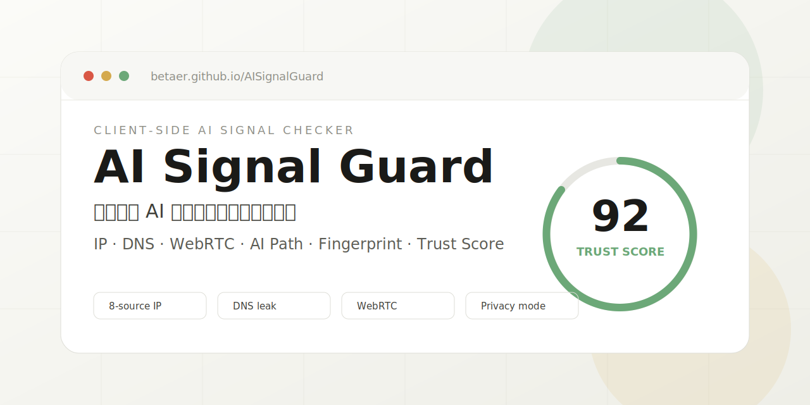

# AI Signal Guard

AI Signal Guard 是一个纯静态的浏览器端 AI 网络与身份信号体检工具。打开网页后，它会从浏览器可见角度检查出口 IP、DNS/WebRTC 泄漏、语言与时区一致性、AI 站点访问路径、服务状态和浏览器指纹，帮助你在使用 ChatGPT、Claude、Gemini、Perplexity 等服务前快速判断当前环境是否自洽。

[在线体验](https://betaer.github.io/AISignalGuard/) · [反馈问题](https://github.com/betaer/AISignalGuard/issues/new/choose) · [查看源码](https://github.com/betaer/AISignalGuard)

 ⭐ Star for AI Signal Guard / 请给本项目点个赞！

## 它解决什么问题

很多网络检测工具只显示“当前 IP 是哪里”。但真实网页、AI 服务、Cloudflare 边缘节点和站点脚本能看到的信号远不止 IP，还包括 DNS 解析器、WebRTC 候选地址、系统时区、浏览器语言、字体、Emoji 渲染、指纹特征和访问目标站点时的边缘路径。

AI Signal Guard 不把启发式评分包装成平台风控结论。它的作用是把这些浏览器侧可见信号集中到一个页面里，方便你排查“AI 服务打不开、网络路径异常、DNS 泄漏、真实出口暴露、身份信号互相矛盾”等问题。

## 核心能力

| 模块 | 检查内容 | 用途 |
|---|---|---|
| 综合信任分 | 启发式 100 分评分、风险项摘要、评分规则 | 快速判断当前环境是否存在明显暴露信号 |
| 出口 IP | IP、地区、ASN、组织、机房/VPN/代理池特征 | 判断最核心的网络出口质量 |
| 身份一致性 | 浏览器语言、系统时区、Emoji、中文字体 | 检查环境画像是否前后矛盾 |
| WebRTC 泄漏 | STUN 候选地址、公网/内网/mDNS 分类 | 发现代理外真实公网地址暴露 |
| DNS 泄漏 | 标准/深度 DNS 泄漏检测、中国解析器识别 | 判断 DNS 是否跟随代理或隧道 |
| 网络连通 | AI 服务、全球站点、常见受限站点、中国站点可达性 | 区分本地网络问题和目标服务不可用 |
| 多源交叉 | 多个 IP 情报源互证 | 发现 IP 地理、ASN、组织信息冲突 |
| AI 路径 | ChatGPT、Claude、OpenAI、Perplexity 等站点路径 | 观察访问 AI 服务时的边缘出口 |
| AI 状态 | OpenAI / Claude 官方状态接口 | 排除平台自身故障，不参与综合信任分 |
| 浏览器指纹 | UserAgent、平台、屏幕、硬件、Canvas、Audio 等 | 查看网页脚本能读到的本机环境 |
| 路由追踪 | macOS / Windows / Linux 命令模板 | 用本机命令复核浏览器无法执行的路径追踪 |
| 复制摘要 | 脱敏诊断文本 | 分享评分、判定口径和风险类别，不带 IP / DNS / 指纹值 |

## 适合谁用

- 经常使用 ChatGPT、Claude、Gemini、Perplexity 的用户，想在登录或排障前检查网络与浏览器信号。
- 遇到“AI 服务打不开、时好时坏、只有某个站点异常”的用户，需要快速区分网络、DNS、服务状态和浏览器环境问题。
- 网络、代理、隐私、安全研究人员，需要从浏览器侧集中观察可见信号。
- 需要截图或文字交流的人：页面提供隐私模式和脱敏诊断摘要，避免直接暴露 IP、DNS、组织和指纹细节。

## 隐私边界

AI Signal Guard 是纯静态页面，没有自建后端。部分检测必须请求第三方公开接口，页面会尽量把“本机计算”和“外部请求”边界讲清楚。

| 类型 | 是否离开浏览器 | 说明 |
|---|---:|---|
| 语言、时区、字体、Emoji、指纹 | 否 | 在本机浏览器内读取和计算 |
| 出口 IP、多源 IP 情报 | 是 | 会请求第三方 IP 情报接口 |
| WebRTC | 是 | 会访问 STUN 服务以观察候选地址 |
| DNS 泄漏 | 是 | 通过第三方 DNS 泄漏检测服务完成 |
| AI 路径、AI 状态 | 是 | 会请求对应公开探针或状态接口；官方服务状态只用于排障，不参与评分 |
| 复制诊断摘要 | 否 | 摘要只包含评分、判定口径和风险类别，不复制 IP、DNS、组织和指纹值 |

## 快速使用

1. 打开 [https://betaer.github.io/AISignalGuard/](https://betaer.github.io/AISignalGuard/)。
2. 等待自动检测完成，先看综合信任分、风险摘要和红黄提示。
3. 展开异常项目，查看详细解释和规避建议。
4. 需要交流时开启“隐私模式”，或点击右下角“复制摘要”分享不含敏感值的诊断文本。
5. 如需复核路由路径，可复制页面给出的 macOS / Windows / Linux 命令在本机终端执行。

## 部署

项目根目录直接提供 `index.html`，GitHub Pages 使用 `main` 分支根目录发布即可。公开仓库只需要保留产品运行相关文件。

## 能力边界

- 不导出截图或 JSON 归档，避免把敏感诊断数据变成易传播文件。
- 移动网络、住宅宽带、云厂商、代理池等归类依赖第三方 IP 情报和 ASN / 组织字段，只作为启发式证据，不作为绝对结论。
- 当数据源没有返回明确的网络类型、隐私标记或运营商信息时，页面不会凭空推断，只展示可验证的字段和疑似风险。
- 后续优化重点是让判定理由更透明，例如展示命中了哪些字段、来自哪个数据源、为什么被归为机房 / 代理 / 运营商网络。

## 免责声明

本项目用于网络诊断、隐私自查和安全研究。评分为启发式参考，不代表任何平台的真实风控结论，也不承诺账号、服务或网络可用性。
